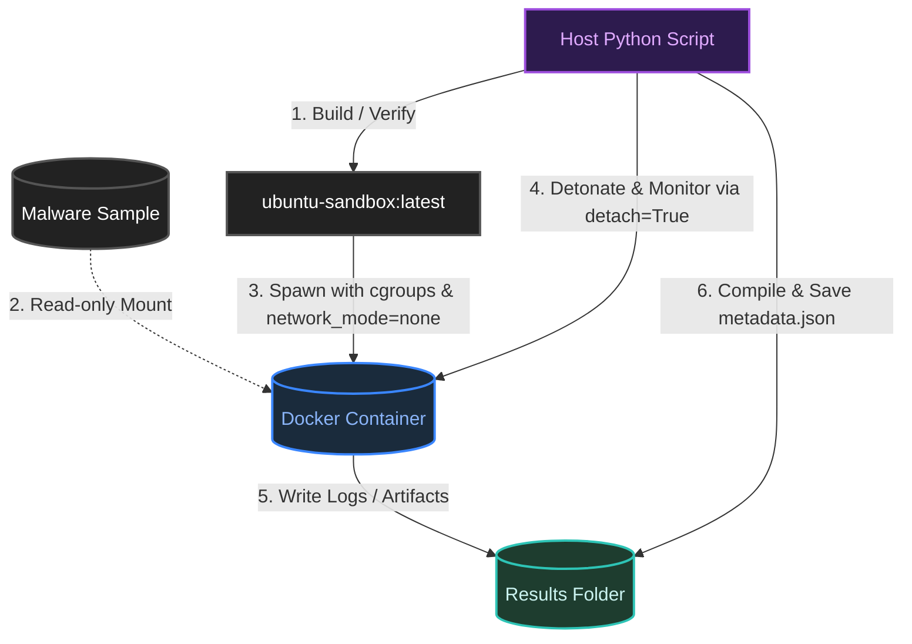

# Introduction
This tool provides a safe, isolated environment to run and analyze potentially malicious scripts. By automatically placing unknown files into a secure container, it lets you observe how they behave without risking your computer. Once the analysis finishes, it cleans up everything and generates a detailed report of the execution.

# Design

## Docker File

1. `FROM ubuntu:24.04` 
	1. Ubuntu was chosen due to the general purpose of the operating system, similar to standard server environments as compared to minimal images (e.g Alpine)
	2. Version 24.04 has Long Term Support (LTS)
2. `ENV DEBIAN_FRONTEND=noninteractive`
	1. Sets a noninteractive shell, so the shell is not waiting for a user response.
	2. Apparently this is common for Docker builds
3. `RUN apt-get update && apt-get install -y python3 strace bash curl netcat-openbsd tcpdump && rm -rf /var/lib/apt/lists/*`
	1. `Python3` was installed to run python files.
	2. `strace` is used to monitor interactions on the system, useful in monitoring the behaviour on all types of files (e.g bash, assembly, python etc.)
	3. `bash` is installed to run bash files
	4. `curl` is installed to run network requests, common in C2
	5. `netcat-openbsd` is installed to run socket testing
	6. `tcpdump` is installed for packet analysing
	7. `rm -rf /var/lib/apt/lists/*`
		1. Cleans up package caches (installation metadata)
		2. This reduces the size of the docker image, allowing faster execution
4. `RUN useradd --create-home --shell /usr/sbin/nologin analyst`
	1. A `analyst` user is added, by uploading the malware as a lower privilege user, it reduces the chances of malware escaping containment. 
	2. `--create-home`:  a home directory is created
	3. `--shell /usr/sbin/nologin`: the login shell is locked so malware cannot log into the container interactively. 
5. `RUN mkdir -p /sandbox /results && chown -R analyst:analyst /sandbox /results`
	1. `RUN mkdir -p /sandbox /results` a sandbox directory is created to upload the malware. a results directory is also created to store logs. 
	2. `chown -R analyst:analyst /sandbox /results` Both directories are owned by the analyst user, which is good practice for a "least privilege"
6. `WORKDIR /sandbox`
	1. sets the sandbox as the default working directory for future interactions. 
7. `USER analyst`
	1. Changes user to analyst, so that it does not run with root privilege. 
8. `ENTRYPOINT ["strace", "-f", "-tt", "-y", "-o", "/results/trace.log"]`
	1. `strace` is used as the entry point, so any command ran after wards is monitored by strace
	2. `-f` fork flag: used to follow and child processes created by the program
	3. `-tt` : Used to prefix every command with Micro-second precision timing
	4. `-y`: Translates raw, abstract file descriptor numbers (like integer `3` or `5`) into their actual file paths or socket targets.
	5. `-o /results/trace.log` : Saves all the logs into a dedicated file instead of dumping it to the console. 

## Python File

This is the settings used for the container to run:

1. `image="ubuntu-sandbox:latest"` : The image that is being used.
2. `command=[executor, f"/sandbox/malware.{filetype}"]`: command used to run the file. `executor` is the program used to run the file for that filetype. (bash, python3)
3. `volumes={abs_sample_path: {'bind': f'/sandbox/malware.{filetype}', 'mode': 'ro'}, host_output_dir: {'bind': '/results', 'mode': 'rw'}}`
    1. The location that the sample is being uploaded to, with READ-ONLY permissions, securely interacting with the file. 
    2. The location that the strace result is stored, with READ-WRITE permissions. 
4. `cap_add=["SYS_PTRACE"]` this grants docker to use `CAP_SYS_TRACE` which allows docker to use `ptrace` system call and related process inspection/debugging. as ptrace is the underlying tool of `strace` that is used for monitoring. 
5. `network_mode="none"` this restricts any network access by the environment, block C2 attempts. although it may result in some malware being benign as it does not detect a network for C2. 
6. `detach=True` this allows the container to run in the background instead. This gives python better control over the container, allowing to keep detonation times, handle non-interactivity of the shell, making cleanup simpler. 
7. `mem_limit="512m", cpu_period=100000, cpu_quota=50000`
    1. Allocate 512 megabytes RAM limit
    2. Enforces CPU period to 100 miliseconds
    3. Enforces CPU quota to 50 miliseconds. 
    4. 50 000/ 100 000 = 1/2 or 0.5, allocating 50% of a single core to the detonation. 
    5. These are set to prevent DoS bombings or resource hogging malware, although some malware will not trigger due to these low constraints. 

This is the metadata file of the file. 
    
1. `Sample`: the name of the file uploaded. 
2. `Metadata (SHA256)`: the file hash of the sample
3. `image`: The image name used to detonate the sample
4. `detonation duration`: Timeout allowed for the sample to run. 
5. `started`: Time the program was ran
6. `container_id`: ID of the docker container used
7. `duration`: total duration of the program
8. `exit_code`: Why the program ended. 
9. `finished`: time the program finished
10. `strace_log`: Location of the log file. 
11. `Directory (SHA256)`: the hash of the files and its contents

