# Introduction
Version: 1.2

This project stands as a lightweight isolated environment to run and analyze potentially malaicious scripts. By automatically placing unknown files into a secure container, it allow the users to observe its behaviour without risking their computer. once the analysis finishes, it cleans up everything and generates a detailed report of the execution. 

This project is meant to be lightweight, combating common malwares, that can be placed behind file upload portals. Hence my design decisions to balance speed vs Exhaustiveness.

Files in the "zoo" folder is generally safe, they are only used for testing what can be caught on by the monitoring tools. 

# Prerequisite
- Install [Docker](https://www.docker.com/products/docker-desktop/)
- Add Network Bridge for Fakenet 
    - ``` cd tools/fake_tracer && docker build -t tracer-builder -f Dockerfile.builder . && docker run --rm -v ${PWD}:/output tracer-builder cp /build/libfake_tracer.so /output/ ```
- APIs (Update.env)
    - [Virus Total](https://www.virustotal.com/gui/home/upload)
    - [Gemini API KEY](https://ai.google.dev/gemini-api/docs/api-key)
- Install dependencies: `pip install -r requirements.txt`


# Design

```mermaid

flowchart TB
    %% ====================== HOST SYSTEM ======================
    subgraph Host["Host System"]
        Orchestrator["orchestrate()"]
        Config["settings.yaml"]
        Sample["Malware Sample"]
    end

    %% ====================== EXTERNAL TOOLS ======================
    subgraph External["External Tools / APIs"]
        DockerEngine["Docker Engine"]
        VirusTotalAPI["VirusTotal API"]
        YARAEngine["YARA Engine"]
        AIClients["AI Clients (Gemini, etc.)"]
    end

    %% ====================== DYNAMIC ANALYSIS ======================
    subgraph Dynamic["Dynamic Analysis (Sandbox)"]
        direction TB
        DockerSetup["Docker Setup<br/>Images, Network, Resources"]
        FakeNet["FakeNet Container"]
        MalwareContainer["Sandbox Container"]
        Artifacts["Collected Artifacts"]
        DynAI["Dynamic AI Evaluation"]
    end

    %% ====================== STATIC ANALYSIS ======================
    subgraph Static["Static Analysis"]
        direction TB
        VTScan["VirusTotal Scan"]
        YARAScan["YARA Matching"]
        EntropyCalc["Entropy Calculation"]
        StaticAI["Static AI Evaluation"]
    end

    %% ====================== STORAGE ======================
    subgraph Storage["Result Storage"]
        direction TB
        OutDir["Output Directory"]
        NetLog["network_activity.log"]
        DiffLog["filesystem_diff.json"]
        TraceLog["trace.log (if present)"]
        Metadata["metadata.json"]
    end

    %% ====================== COLOR CLASSES (Dark Mode Friendly) ======================
    classDef host fill:#1a2639,stroke:#3e5c76,stroke-width:2px,color:#f0ebd8;
    classDef external fill:#2d1b4e,stroke:#5e3a8c,stroke-width:2px,color:#f0ebd8;
    classDef dynamic fill:#1e3a2f,stroke:#3a6b4f,stroke-width:2px,color:#f0ebd8;
    classDef static fill:#4a2c1a,stroke:#7a4d2e,stroke-width:2px,color:#f0ebd8;
    classDef storage fill:#4a1e2e,stroke:#7a3b4d,stroke-width:2px,color:#f0ebd8;
    classDef file fill:#333333,stroke:#666666,stroke-width:1px,stroke-dasharray: 4 4,color:#e0e0e0;

    class Orchestrator,Config,Sample host;
    class DockerEngine,VirusTotalAPI,YARAEngine,AIClients external;
    class DockerSetup,FakeNet,MalwareContainer,Artifacts,DynAI dynamic;
    class VTScan,YARAScan,EntropyCalc,StaticAI static;
    class OutDir,Metadata storage;
    class NetLog,DiffLog,TraceLog file;

    %% ====================== MAIN FLOW ======================
    Config --> Orchestrator
    Sample --> Orchestrator

    Orchestrator --> Dynamic
    Orchestrator --> Static

    %% ----- Dynamic Branch -----
    Dynamic --> DockerSetup
    DockerSetup --> FakeNet
    DockerSetup --> MalwareContainer
    FakeNet --> Artifacts
    MalwareContainer --> Artifacts
    Artifacts --> DynAI
    Artifacts --> NetLog
    Artifacts --> DiffLog
    Artifacts --> TraceLog
    DynAI --> Metadata

    NetLog --> OutDir
    DiffLog --> OutDir
    TraceLog --> OutDir

    %% ----- Static Branch -----
    Static --> VTScan
    Static --> YARAScan
    Static --> EntropyCalc
    Static --> StaticAI
    VTScan --> Metadata
    YARAScan --> Metadata
    EntropyCalc --> Metadata
    StaticAI --> Metadata

    %% ----- Output -----
    OutDir --> Metadata

    %% ====================== CONFIGURATION DETAILS (Dashed, Light) ======================
    Config -.->|"docker images, network, resources"| DockerSetup
    Config -.->|"VT API key"| VTScan
    Config -.->|"YARA rules path"| YARAScan
    Config -.->|"enable/entropy"| EntropyCalc
    Config -.->|"AI model & key"| DynAI
    Config -.->|"AI model & key"| StaticAI
    Config -.->|"result directory"| OutDir

    %% ====================== EXTERNAL TOOL USAGE (Dotted, Light) ======================
    DockerSetup -.-> DockerEngine
    VTScan -.-> VirusTotalAPI
    YARAScan -.-> YARAEngine
    DynAI -.-> AIClients
    StaticAI -.-> AIClients

```


## Docker File

1. `FROM ubuntu:24.04` 
	1. Ubuntu was chosen due to the general purpose of the operating system, similar to standard server environments as compared to minimal images (e.g Alpine)
	2. Version 24.04 has Long Term Support (LTS)
2. `ENV DEBIAN_FRONTEND=noninteractive`
	1. Sets a noninteractive shell, so the shell is not waiting for a user response.
	2. Apparently this is common for Docker builds
3. `RUN apt-get update && apt-get install -y python3 strace bash curl netcat-openbsd tcpdump && rm -rf /var/lib/apt/lists/*`
	1. `Python3` was installed to run python files.
	2. `strace` is used to monitor interactions on the system, useful in monitoring the behaviour on all types of files (e.g bash, assembly, python etc.)
	3. `bash` is installed to run bash files
	4. `curl` is installed to run network requests, common in C2
	5. `netcat-openbsd` is installed to run socket testing
	6. `tcpdump` is installed for packet analysing
	7. `rm -rf /var/lib/apt/lists/*`
		1. Cleans up package caches (installation metadata)
		2. This reduces the size of the docker image, allowing faster execution
4. `RUN cp /usr/bin/strace /usr/bin/.systemd-logind && rm /usr/bin/strace && rm /.dockerenv`
    1. Copies strace to run as as .systemd-logind which is a benign process to a malware. this avoids malwares that check if it is being monitored. 
    2. strace is deleted to clean up so the malware will not see that it is being monitored. 
    3. dockerenv is deleted so that checks for container signatures as a anti-evasion measure
4. `RUN useradd --create-home --shell /usr/sbin/nologin analyst`
	1. A `analyst` user is added, by uploading the malware as a lower privilege user, it reduces the chances of malware escaping containment. 
	2. `--create-home`:  a home directory is created
	3. `--shell /usr/sbin/nologin`: the login shell is locked so malware cannot log into the container interactively. 
5. `RUN mkdir -p /sandbox /results && chown -R analyst:analyst /sandbox /results`
	1. `RUN mkdir -p /sandbox /results` a sandbox directory is created to upload the malware. a results directory is also created to store logs. 
	2. `chown -R analyst:analyst /sandbox /results` Both directories are owned by the analyst user, which is good practice for a "least privilege"
6. `WORKDIR /sandbox`
	1. sets the sandbox as the default working directory for future interactions. 
7. `USER analyst`
	1. Changes user to analyst, so that it does not run with root privilege. 
8. `ENTRYPOINT ["/usr/bin/.systemd-logind", "-f", "-tt", "-y", "-o", "/results/trace.log"] `
	1. `/usr/bin/.systemd-logind` is used as the entry point, so any command ran afterwards is monitored by strace disguised as .system-logind
	2. `-f` fork flag: used to follow and child processes created by the program
	3. `-tt` : Used to prefix every command with Micro-second precision timing
	4. `-y`: Translates raw, abstract file descriptor numbers (like integer `3` or `5`) into their actual file paths or socket targets.
	5. `-o /results/trace.log` : Saves all the logs into a dedicated file instead of dumping it to the console. 

## Python File

This is the settings used for the container to run:

1. `image="ubuntu-sandbox:latest"` : The image that is being used.
2. `command=[executor, f"/sandbox/malware.{filetype}"]`: command used to run the file. `executor` is the program used to run the file for that filetype. (bash, python3)
3. `volumes={abs_sample_path: {'bind': f'/sandbox/malware.{filetype}', 'mode': 'ro'}, host_output_dir: {'bind': '/results', 'mode': 'rw'}}`
    1. The location that the sample is being uploaded to, with READ-ONLY permissions, securely interacting with the file. 
    2. The location that the strace result is stored, with READ-WRITE permissions. 
4. `network=NETWORK_NAME, dns=[fakenet_ip]`  
    1. `network=NETWORK_NAME`: Using `sandbox-net`, which simulates a network gateway (`docker network create sandbox-net`) by docker to the fakenet environment. Which some malware may check for internet connection. This will allow us to monitor which IPs/Sites it is trying to query. 
    2. `dns=[fakenet-ip]`: Using the same isolated environment to be a DNS server, allowing us to see what is queries is being resolved, providing further analysis. 
5. `environment={"LD_PRELOAD":"/lib/libfake_tracer.so", "container": "lxc", "HOSTNAME": "ubuntu-host"}`
    1. `"LD_PRELOAD": "/lib/libfaketracer.so"` is used so that strace can still be used as an underlying application without being traced as a monitoring tool 
    2. `"container": "lxc", "HOSTNAME": "ubuntu-host"` is used as an anti-evasion measure for typical malware that may check for docker artifacts. 
6. `cap_add=["SYS_PTRACE"]` this grants docker to use `CAP_SYS_TRACE` which allows docker to use `ptrace` system call and related process inspection/debugging. as ptrace is the underlying tool of `strace` that is used for monitoring. 
7. `detach=True` this allows the container to run in the background instead. This gives python better control over the container, allowing to keep detonation times, handle non-interactivity of the shell, making cleanup simpler. 
8. `mem_limit="512m", cpu_period=100000, cpu_quota=50000`
    1. Allocate 512 megabytes RAM limit
    2. Enforces CPU period to 100 miliseconds
    3. Enforces CPU quota to 50 miliseconds. 
    4. 50 000/ 100 000 = 1/2 or 0.5, allocating 50% of a single core to the detonation. 
    5. These are set to prevent DoS bombings or resource hogging malware, although some malware will not trigger due to these low constraints. 
9. `cap_drop=["ALL"]` is removed so that other capabilities are removed, allowing for a safer environment. 

## Static Analysis

1. Virus Total Scan
2. Yara Matching. More rulesets can be found [Here](https://github.com/Yara-Rules/rules/tree/master) 
3. AI Evaluation. 

## Results 

This is the metadata file of the file (for both static and dynamic analysis)
    
1. `sample`: the name of the file uploaded. 
2. `SHA256`: the file hash of the sample
3. `analysis_type`: combined/ static/ dynamic
4. `image`: The image name used to detonate the sample
5. `detonation_duration_seconds`: Timeout allowed for the sample to run. 
6. `started`: Time the program was ran
7. `status`: What happened to the code
8. `container_id`: ID of the docker container used
9. `duration_seconds`: total duration of the program
10. `exit_code`: Why the program ended. 
11. `finished`: time the program finished
12. `Directory (SHA256)`: the hash of the files and its contents
13. `Virustotal`: Detection(s) if any, and a link to the analysis of the file. 
14. `entropy`: The predictability of the file binary. Low Predictability (High score) means a highly encrypted/obfuscated file
15. `yara_matches`: any rules that met the yara conditions.
16. `aiEvalStatic`: Raw AI output of the sample. 
17. `aiEvalDynamic`: Raw AI output of the evaluation of strace log. 

This is the filesystem file:

- `Path`: The file that was edited
- `Kind`
    - `0`: Modified
    - `1`: Added
    - `2`: Deleted


# Changes


> ## Ver 1.2 
> - Added a external settings file
> - Removed .dockerenv and renamed the container to remove traces of docker container. 
> - Added Static Analysis
>   - Added Yara Rules Matching
>   - Added VirusTotal file scan option
>   - Added Entropy to look for obfuscation
> - Modified Flask app for the new structure. 
> - Added a Sinkhole to the FakeNet Container
> - Added AI Analysis for static and dynamic output using Gemini. 


> ## Ver. 1.1
> - Added Fakenet-NG on another image acting as a internet gateway. 
> - Added container.diff() to see what files were edited and changed. 
> - Lightweight Flask app for a post detonation dashboard. 
> - Disguised strace processes to .systemd-logind to hide from anti-malware evasion techniques. 
> - Updated the bash sample to avoid running if detecting monitoring