# Introduction
Version: 1.3

This project stands as a lightweight isolated environment to run and analyze potentially malicious scripts. By automatically placing unknown files into a secure container, it allows users to observe their behaviour without risking their computer. Once the analysis finishes, it cleans up everything and generates a detailed report of the execution.

This project is meant to be lightweight, combating common malware, that can be placed behind file upload portals. Hence my design decisions to balance speed vs exhaustiveness.

Files in the "zoo" folder are generally safe; they are only used for testing what can be caught by the monitoring tools.

# Prerequisite
- Install [Docker](https://www.docker.com/products/docker-desktop/)
- Add Network Bridge for Fakenet
    - ``` cd tools/fake_tracer && docker build -t tracer-builder -f Dockerfile.builder . && docker run --rm -v ${PWD}:/output tracer-builder cp /build/libfake_tracer.so /output/ ```
- APIs (Update `.env`)
    - [Virus Total](https://www.virustotal.com/gui/home/upload)
    - [Gemini API KEY](https://ai.google.dev/gemini-api/docs/api-key)
- Install dependencies: `pip install -r requirements.txt`
- Run app.py for GUI, run detonate.py for CLI


# Design

```mermaid

flowchart TB
    %% ====================== HOST SYSTEM ======================
    subgraph Host["Host System"]
        Orchestrator["orchestrate()"]
        Config["settings.yaml"]
        Sample["Malware Sample"]
    end

    %% ====================== EXTERNAL TOOLS ======================
    subgraph External["External Tools / APIs"]
        DockerEngine["Docker Engine"]
        VirusTotalAPI["VirusTotal API"]
        YARAEngine["YARA Engine"]
        AIClients["AI Clients (Gemini, etc.)"]
    end

    %% ====================== DYNAMIC ANALYSIS ======================
    subgraph Dynamic["Dynamic Analysis (Sandbox)"]
        direction TB
        DockerSetup["Docker Setup<br/>Images, Network, Resources"]
        FakeNet["FakeNet Container"]
        MalwareContainer["Sandbox Container"]
        Artifacts["Collected Artifacts"]
        DynAI["Dynamic AI Evaluation"]
    end

    %% ====================== STATIC ANALYSIS ======================
    subgraph Static["Static Analysis"]
        direction TB
        VTScan["VirusTotal Scan"]
        YARAScan["YARA Matching"]
        EntropyCalc["Entropy Calculation"]
        StaticAI["Static AI Evaluation"]
    end

    %% ====================== STORAGE ======================
    subgraph Storage["Result Storage"]
        direction TB
        OutDir["Output Directory"]
        NetLog["network_activity.log"]
        DiffLog["filesystem_diff.json"]
        TraceLog["trace.log (if present)"]
        Metadata["metadata.json"]
    end

    %% ====================== COLOR CLASSES (Dark Mode Friendly) ======================
    classDef host fill:#1a2639,stroke:#3e5c76,stroke-width:2px,color:#f0ebd8;
    classDef external fill:#2d1b4e,stroke:#5e3a8c,stroke-width:2px,color:#f0ebd8;
    classDef dynamic fill:#1e3a2f,stroke:#3a6b4f,stroke-width:2px,color:#f0ebd8;
    classDef static fill:#4a2c1a,stroke:#7a4d2e,stroke-width:2px,color:#f0ebd8;
    classDef storage fill:#4a1e2e,stroke:#7a3b4d,stroke-width:2px,color:#f0ebd8;
    classDef file fill:#333333,stroke:#666666,stroke-width:1px,stroke-dasharray: 4 4,color:#e0e0e0;

    class Orchestrator,Config,Sample host;
    class DockerEngine,VirusTotalAPI,YARAEngine,AIClients external;
    class DockerSetup,FakeNet,MalwareContainer,Artifacts,DynAI dynamic;
    class VTScan,YARAScan,EntropyCalc,StaticAI static;
    class OutDir,Metadata storage;
    class NetLog,DiffLog,TraceLog file;

    %% ====================== MAIN FLOW ======================
    Config --> Orchestrator
    Sample --> Orchestrator

    Orchestrator --> Dynamic
    Orchestrator --> Static

    %% ----- Dynamic Branch -----
    Dynamic --> DockerSetup
    DockerSetup --> FakeNet
    DockerSetup --> MalwareContainer
    FakeNet --> Artifacts
    MalwareContainer --> Artifacts
    Artifacts --> DynAI
    Artifacts --> NetLog
    Artifacts --> DiffLog
    Artifacts --> TraceLog
    DynAI --> Metadata

    NetLog --> OutDir
    DiffLog --> OutDir
    TraceLog --> OutDir

    %% ----- Static Branch -----
    Static --> VTScan
    Static --> YARAScan
    Static --> EntropyCalc
    Static --> StaticAI
    VTScan --> Metadata
    YARAScan --> Metadata
    EntropyCalc --> Metadata
    StaticAI --> Metadata

    %% ----- Output -----
    OutDir --> Metadata

    %% ====================== CONFIGURATION DETAILS (Dashed, Light) ======================
    Config -.->|"docker images, network, resources"| DockerSetup
    Config -.->|"VT API key"| VTScan
    Config -.->|"YARA rules path"| YARAScan
    Config -.->|"enable/entropy"| EntropyCalc
    Config -.->|"AI model & key"| DynAI
    Config -.->|"AI model & key"| StaticAI
    Config -.->|"result directory"| OutDir

    %% ====================== EXTERNAL TOOL USAGE (Dotted, Light) ======================
    DockerSetup -.-> DockerEngine
    VTScan -.-> VirusTotalAPI
    YARAScan -.-> YARAEngine
    DynAI -.-> AIClients
    StaticAI -.-> AIClients

```



## Docker File

1. `FROM ubuntu:24.04` 
    1. Ubuntu was chosen due to the general purpose of the operating system, similar to standard server environments as compared to minimal images (e.g. Alpine).
    2. Version 24.04 has Long Term Support (LTS).
2. `ENV DEBIAN_FRONTEND=noninteractive`
    1. Sets a noninteractive shell, so the shell is not waiting for a user response.
    2. This is common practice for Docker builds.
3. `RUN apt-get update && apt-get install -y python3 strace bash curl netcat-openbsd tcpdump && rm -rf /var/lib/apt/lists/*`
    1. `python3` was installed to run Python files.
    2. `strace` is used to monitor interactions on the system, useful in monitoring the behaviour on all types of files (e.g. bash, assembly, python etc.).
    3. `bash` is installed to run bash scripts.
    4. `curl` is installed to run network requests, common in C2.
    5. `netcat-openbsd` is installed for socket testing.
    6. `tcpdump` is installed for packet analysis.
    7. `rm -rf /var/lib/apt/lists/*` cleans up package caches (installation metadata) reducing the size of the Docker image, allowing faster execution.
4. `RUN cp /usr/bin/strace /usr/bin/.systemd-logind && rm /usr/bin/strace && rm /.dockerenv`
    1. Copies `strace` to a hidden name `.systemd-logind` which appears as a benign process to malware; this avoids malware that checks if it is being monitored.
    2. The original `strace` is deleted to remove traces of monitoring.
    3. `/.dockerenv` is deleted so that container signatures are hidden as an anti‑evasion measure.
5. `RUN useradd --create-home --shell /usr/sbin/nologin analyst`
    1. An `analyst` user is added; by running the malware as a low‑privilege user, the chances of malware escaping containment are reduced.
    2. `--create-home` creates a home directory.
    3. `--shell /usr/sbin/nologin` locks the login shell so malware cannot log into the container interactively.
6. `RUN mkdir -p /sandbox /results && chown -R analyst:analyst /sandbox /results`
    1. Creates a `/sandbox` directory for the malware and a `/results` directory to store logs.
    2. `chown -R analyst:analyst /sandbox /results` ensures both directories are owned by the `analyst` user, following the principle of least privilege.
7. `WORKDIR /sandbox`
    1. Sets the sandbox as the default working directory for future interactions.
8. `USER analyst`
    1. Switches to the `analyst` user so the container does not run with root privileges.
9. `ENTRYPOINT ["/usr/bin/.systemd-logind", "-f", "-tt", "-y", "-o", "/results/trace.log"]`
    1. Uses the disguised `strace` as the entry point so every command executed is monitored.
    2. `-f` follows child processes created by the program.
    3. `-tt` prefixes every line with microsecond‑precision timestamps.
    4. `-y` translates raw file descriptors (e.g., `3` or `5`) into actual file paths or socket targets.
    5. `-o /results/trace.log` saves all logs into a dedicated file instead of dumping to the console.

## Python File Configuration

This is the settings used for the container to run:

1. `image="ubuntu-sandbox:latest"` – The image that is being used.
2. `command=[executor, f"/sandbox/sample.{filetype}"]` – The command used to run the file; `executor` is the program determined by the file type (e.g., `bash`, `python3`).
3. `volumes={abs_sample_path: {'bind': f'/sandbox/sample.{filetype}', 'mode': 'ro'}, output_dir: {'bind': '/results', 'mode': 'rw'}}`
    1. The sample is mounted read‑only into `/sandbox/sample.{filetype}`.
    2. The results directory is mounted read‑write to `/results` for logs.
4. `network_mode=f"container:{fakenet_container.id}"` – The sandbox container shares the network stack of the FakeNet container, giving it full network visibility.
5. `environment={"LD_PRELOAD": "/lib/libfake_tracer.so", "container": "lxc", "HOSTNAME": "ubuntu-host"}` – Additional anti‑evasion: LD_PRELOAD hides monitoring, and environment variables mimic LXC.
6. `cap_add=["SYS_PTRACE"]` – Grants `ptrace` capability, required for `strace` to function.
7. `detach=True` – Runs the container in the background, giving Python better control over timeouts and cleanup.
8. `mem_limit="512m", pids_limit=256, cpu_period=100000, cpu_quota=50000, cpuset_cpus="0-1"` – Limits memory, processes, and CPU usage. The `cpuset_cpus` option restricts the container to only 2 CPU cores to mimic a typical low‑end VPS, reducing sandbox detection.
9. `cap_drop=["ALL"]` – Drops all other Linux capabilities for a more restrictive environment.

## Static Analysis

1. VirusTotal scan (with automated upload and polling).
2. YARA rule matching (rules are compiled once and cached for performance).
3. Entropy calculation (streaming, memory‑efficient).
4. AI evaluation using Gemini (static file analysis).

## Results

This is the metadata file of the analysis (for both static and dynamic analysis):
    
1. `sample`: the name of the file uploaded.
2. `SHA256`: the file hash of the sample.
3. `analysis_type`: `combined`, `static`, or `dynamic`.
4. `image`: The image name used to detonate the sample.
5. `detonation_duration_seconds`: Timeout allowed for the sample to run.
6. `started`: When the program started.
7. `status`: What happened to the code (e.g., `completed`, `timeout`, `failed`).
8. `container_id`: ID of the Docker container used.
9. `duration_seconds`: Total duration of the program.
10. `exit_code`: Exit code of the sample.
11. `finished`: When the program finished.
12. `Directory_SHA256`: Hash of the results directory (used for integrity verification).
13. `virustotal`: Detection statistics and a link to the VirusTotal report.
14. `entropy`: Shannon entropy of the file (higher = more obfuscated).
15. `yara_matches`: List of YARA rules that triggered.
16. `aiEvalStatic`: AI‑generated summary of the static analysis.
17. `aiEvalDynamic`: AI‑generated summary of the strace log.

The filesystem diff (`filesystem_diff.json`) contains:
- `Path`: The file path that changed.
- `Kind`: `0` (Modified), `1` (Added), `2` (Deleted).

# Changes

> ## Ver 1.3
> - Added CLI capabilities.
> - Added Job Polling.
> - Added thread concurrency.
> - Added File upload limit.
> - Added more checks to improve reliability.
> - Added Polling for the Flask app.
> - Modified Kernel parameter
> - Added file type detection
> - Added pre-detonation delay for malwares that may check uptime
> - Added Docker Build lock

> ## Ver 1.2 
> - Added an external settings file.
> - Removed `.dockerenv` and renamed the container to remove traces of Docker.
> - Added Static Analysis:
>   - YARA Rules Matching.
>   - VirusTotal file scan option.
>   - Entropy to look for obfuscation.
> - Modified Flask app for the new structure.
> - Added a Sinkhole to the FakeNet Container.
> - Added AI Analysis for static and dynamic output using Gemini.

> ## Ver 1.1
> - Added FakeNet‑NG on another image acting as an internet gateway.
> - Added `container.diff()` to see what files were edited and changed.
> - Lightweight Flask app for a post‑detonation dashboard.
> - Disguised `strace` processes as `.systemd-logind` to hide from anti‑malware evasion techniques.
> - Updated the bash sample to avoid running if detecting monitoring.
